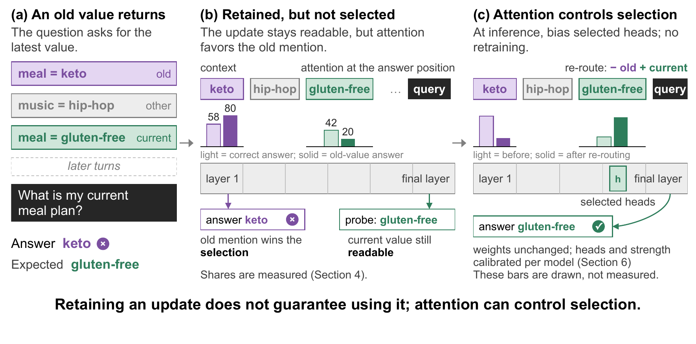
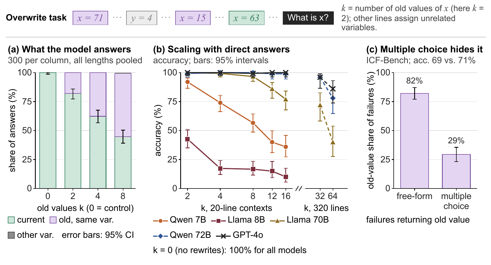
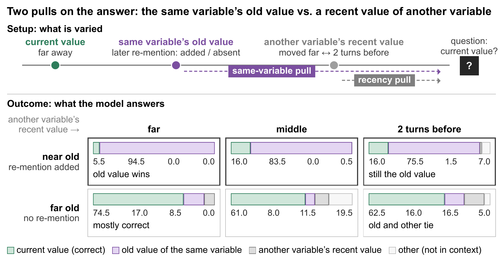
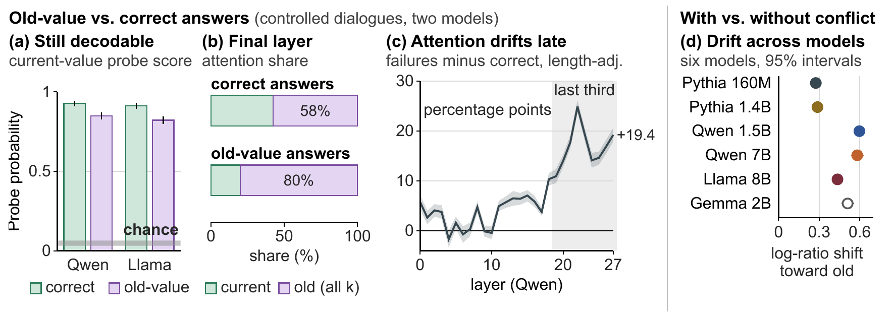
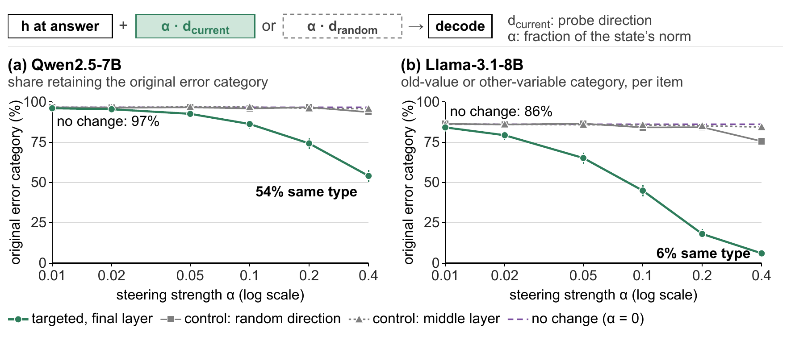
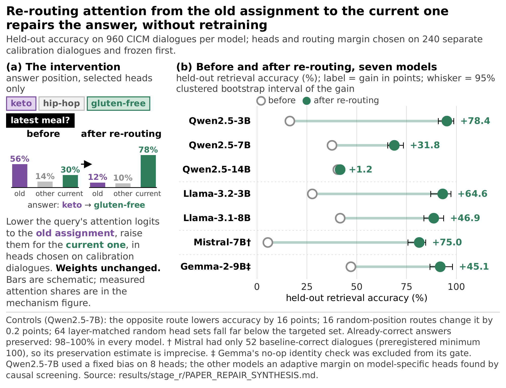
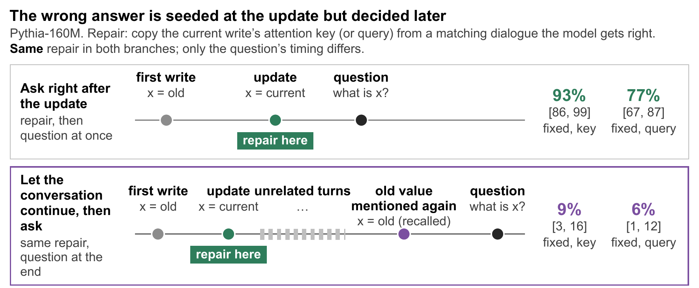

<h1 align="center">CICM: Controlled In-Context Memory</h1>

<p align="center">
  <b>When Context Changes: Understanding Update Failures in LLMs</b><br>
  Code, data, and results for studying <i>stale binding</i>: why language models answer from a value that the context has already replaced.
</p>

<p align="center">
  <a href="https://arxiv.org/abs/2609.38866"></a>
  <a href="LICENSE"></a>
  <a href="data/LICENSE.md"></a>
  
  
</p>

<p align="center">
  
</p>

A user says *keto*, later changes it to *gluten-free*, and then asks what their meal plan is.
Models answer **keto**. The error is not caused by context length (equally long contexts
without revisions are solved) and not by forgetting (the current value is still linearly
readable from the hidden state). What fails is **selection**: attention at the answer position
lands on the old assignment. Re-routing that attention at inference time, with no retraining,
restores the current value.

This repository contains the **CICM** probe set (1,200 preference dialogues with program-known
updates, competitors, and answers), the controlled overwrite tasks, the external-benchmark and
frontier-model evaluations, the full mechanism pipeline (probes, attention, steering,
component patching, an exhaustive head analysis in Pythia-160M), the test-time attention
routing correction, and every report, summary, and figure behind the paper.

---

## The failure in one real dialogue

One of the 1,200 CICM dialogues (Qwen2.5-7B; 38 messages, only the turns that carry
controlled values are shown):

| Turn | Speaker | Message | Role in the dialogue |
|:---:|:---|:---|:---|
| 3 | user | I want to switch to **gluten free** meals. | old value · 34 turns before the question |
| 7 | user | Can you set my meal style to **mediterranean**? | current value · 30 before |
| 13 | user | I'd say **discussion** is the method that helps me most. | another variable · 24 before |
| 35 | user | I am still thinking about **gluten free** when I compare options for my meal style. | old value mentioned again · 2 before |
| 37 | user | For my meal style specifically, what is the latest value I chose? Reply with only the value. | question |
| | **model** | **gluten free** ✗ | expected: **mediterranean** |

The assistant acknowledged the update at turn 8, then answered with the value it replaced.
Every CICM dialogue records the position of each value mention, so answers are scored by
exact matching against a fixed vocabulary, never by an LLM judge.

---

## A guided tour of the results

### 1. Old values, not length, cause the failure

<p align="center"></p>

With no rewrites, accuracy is 100% at every context length. As old values of the queried
variable accumulate, accuracy falls from 91% to 38%, and **331 of 333 errors return an earlier
value of the same variable** (two copy another variable, none are hallucinated). Larger
models move the break point rather than remove it: Qwen2.5-72B and GPT-4o hold through 16 old
values and fall to 78% and 86% at 64. Multiple-choice evaluation hides the signature: on
ICF-Bench, 82% of free-form failures return the old preference, only 29% do when the options
are listed, at the same overall accuracy.
<sub>Sources: `results/p0_qwen7b.summary.json`, `results/stage_e/qwen_p0_errors.summary.json`, `results/stage_f/hard_tier/`, `results/stage_k/`.</sub>

### 2. Two pulls on the answer: variable identity vs. recency

<p align="center"></p>

CICM moves two competitors independently: the queried variable's old value (near or far from
the question) and another variable's recent value (far, middle, or two turns before). With the
old value nearby, **94.5% of answers are that old value**, even when another variable was
updated two turns ago. With both competitors far, accuracy is 74.5% and the two error types
tie. Identity dominates; recency only catches up when identity's pull is weak.
<sub>Source: `results/stage_l/natural_factorial_otherdist_l0/`.</sub>

### 3. The update is retained; attention selects the old one

<p align="center"></p>

On failures, a linear probe still reads the current value from the final hidden state with
probability **0.85** (Qwen2.5-7B) and **0.82** (Llama-3.1-8B), against 0.03–0.06 with shuffled
labels. The information is there. What differs is where the answer position looks: on Qwen
failures it puts **80% of its attention on old assignments** (58% when it answers correctly),
and the extra pull appears in the last third of the network, where the answer is decided.
Introducing a conflicting update shifts attention toward the old value in all six open models
tested, including the ones that still answer correctly.
<sub>Sources: `results/stage_l/natural_factorial_otherdist_l1/`, `.../otherdist_llama/l1/`, `results/stage_p/`.</sub>

### 4. Selection is causal, and it happens late

<p align="center"></p>

Adding the probe direction at the answer position removes most errors as the dose grows
(Qwen 97% → 54% still wrong, Llama 86% → 6%), while an equally large random direction and the
same vector at a middle layer do nothing. Component patching points the same way: replacing
late hidden states restores 78% of the answer-score gap, old-assignment keys alone restore 49%,
early and middle states restore none. In Pythia-160M, where every head can be examined,
disabling the 12 heads that most favor old values corrects **38% of unseen failures** against
9% for random heads from the same layers.
<sub>Sources: `results/stage_l/validity_l2/`, `results/stage_g/circuit/`, `results/stage_n/`.</sub>

### 5. Re-routing attention repairs the answer, with no retraining

<p align="center"></p>

If the failure is selection, moving attention from the old assignment to the current one
should fix it. It does. Lowering the query's attention logits to old-assignment tokens and
raising them for the current assignment, in a small set of heads chosen on calibration
dialogues, raises held-out accuracy by **+32 to +78 points on six of seven models** (Qwen2.5-14B
is the exception at +1), with 98–100% of already-correct answers preserved. Reversing the
route hurts; random positions do nothing. Weights are never changed.
<sub>Source: `results/stage_r/PAPER_REPAIR_SYNTHESIS.md` and the per-model records in `results/stage_r/crossmodel/`.</sub>

### 6. When the wrong answer forms

<p align="center"></p>

Repairing the current value's attention key fixes 93% of failures if the question follows the
update immediately, but only 9% once the rest of the conversation precedes it. Later context
rebuilds the competition, so selection has to be maintained, not fixed once.
<sub>Source: `results/stage_p/`.</sub>

---

## What is in the repository

```
data/stage_l/     CICM: 1,200 dialogues (3 variables × 7 values; overwrite dose 1–6;
                  2 × 3 identity-by-recency factorial), datasheets, pilot variants
data/             synthetic overwrite tasks; BABILong / Entity Tracking / RULER-VT subsets
src/              every script, flat: generators, evaluation, probes, attention, steering,
                  patching, Pythia circuit, frontier panel, test-time routing, figures
results/          per-stage REPORT.md, *.summary.json, figures, small per-example records
slurm/            the exact job scripts behind each result directory
paper_assets/     figure sources (HTML) and vector PDFs, LaTeX result tables
tests/            208 CPU-only tests
```

See **[REPRODUCING.md](REPRODUCING.md)** for the stage-by-stage map of scripts to results
and the commands for each step.

## Use CICM in three commands

```bash
pip install -r requirements.txt && export PYTHONPATH=src
python src/stage_l_eval.py generate --data data/stage_l/cicm_natural_factorial_otherdist_l0.jsonl \
    --out results/my_run/rows.jsonl --summary-out results/my_run/summary.json \
    --report-out results/my_run/REPORT.md --model Qwen/Qwen2.5-7B-Instruct --dtype bfloat16 --max-new-tokens 16
python src/stage_l_mech.py harvest --rows results/my_run/rows.jsonl --out-dir results/my_run/mech \
    --model Qwen/Qwen2.5-7B-Instruct --dtype float32   # probe + attention; then: stage_l_mech.py analyze
```

The first command scores any chat model on CICM and writes the four-way answer classification
(current value, old value of the same variable, value of another variable, other). The second
measures whether the current value is still decodable and where attention goes on failures.

## Citation

```bibtex
@article{guo2026context,
  title   = {When Context Changes: Understanding Update Failures in LLMs},
  author  = {Guo, Junyu and Fang, Yuchen and Gu, Shangding and Spanos, Costas and Demmel, James and Lavaei, Javad},
  journal = {arXiv preprint arXiv:2609.38866},
  year    = {2026}
}
```

## License

Code is released under the MIT License ([`LICENSE`](LICENSE)). Datasets and per-example model
outputs are released under CC BY-NC 4.0 ([`data/LICENSE.md`](data/LICENSE.md)) because CICM's
preference vocabulary derives from PrefEval, which carries that license. The Source Sans 3
fonts in `paper_assets/fonts/` are under the SIL Open Font License.
