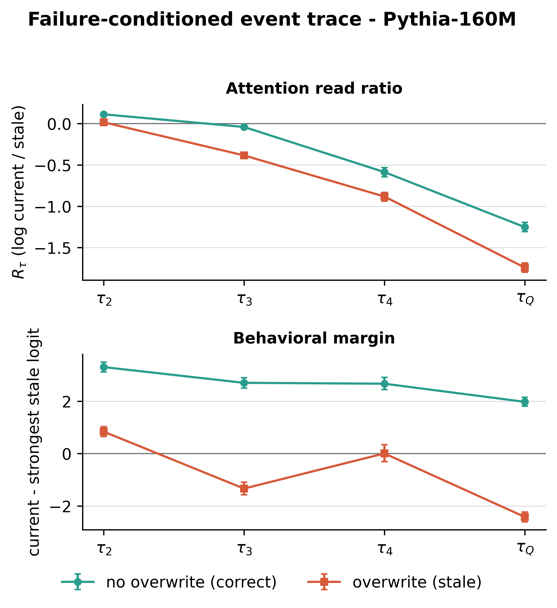
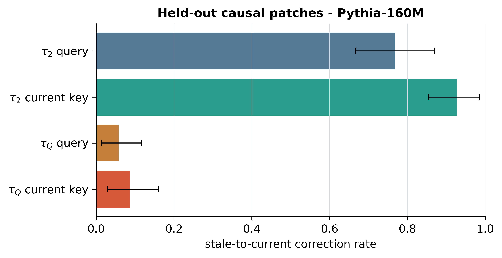
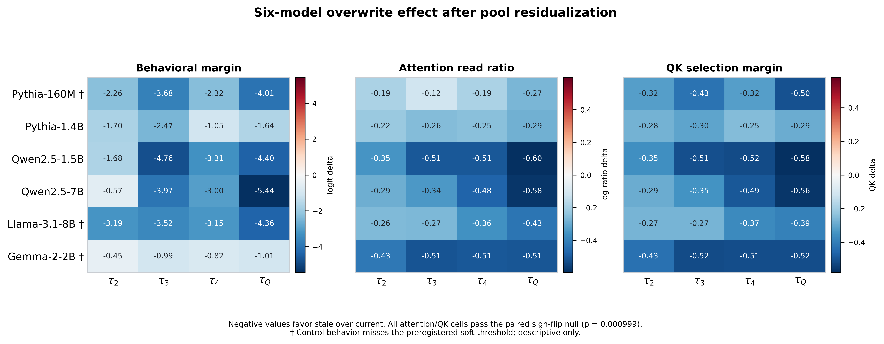

# Stage P: Event-Aligned Inference Trace

## Preregistered verdict

**The strong inevitability gate fails.** On Pythia-160M, a failure-conditioned current-to-stale separation is already visible immediately after the update (`tau2`) and predicts the counterfactual final arm out of sample. Patching the clean key/query in the `tau2` branch strongly repairs the local answer. However, reapplying the clean current-write key or query in the full `tauQ` branch corrects few held-out errors. The update therefore contains a real early write-side distortion, but it does not alone make the later stale answer inevitable; later selection dynamics can re-form the failure.

**The honest adjudication is mixed write-side plus later read-side competition, not a single-time-point failure.** Among 121 final stale Pythia examples, 39 already have a stale-favoring pooled QK margin at `tau2`, while 82 cross only after `tau2`. The current value remains decodable above shuffle throughout, although decodability weakens in stale runs.

**A broad descriptive signature transfers, but failure-conditioned timing does not.** In all six models, overwrite branches shift the residualized attention read ratio and QK margin toward stale values relative to exact same-length no-overwrite branches from `tau2` onward (all paired sign-flip `p=0.000999`). On this frozen substrate, only Pythia-160M supplies the preregistered minimum of 20 exact final correct/stale pairs. Larger models mostly answer correctly, and Gemma fails the no-overwrite behavior control. Their trajectories are descriptive evidence of competition pressure, not cross-model replication of the failure mechanism.

## Model gates

| Model | n | Final current / stale / other | Exact failure pairs | Same length | Control soft gate | Failure-conditioned mechanism |
|---|---:|---:|---:|---:|---:|---|
| Pythia-160M | 144 | 15 / 129 / 0 | 121 | PASS | MISS | PASS |
| Pythia-1.4B | 144 | 143 / 1 / 0 | 1 | PASS | PASS | NOT IDENTIFIED (1 < 20) |
| Qwen2.5-1.5B | 144 | 136 / 8 / 0 | 8 | PASS | PASS | NOT IDENTIFIED (8 < 20) |
| Qwen2.5-7B | 72 | 71 / 1 / 0 | 1 | PASS | PASS | NOT IDENTIFIED (1 < 20) |
| Llama-3.1-8B | 72 | 70 / 2 / 0 | 2 | PASS | MISS | NOT IDENTIFIED (2 < 20) |
| Gemma-2-2B | 144 | 68 / 14 / 62 | 8 | PASS | MISS | NOT IDENTIFIED (8 < 20) |

## Failure-conditioned temporal localization

Pythia-160M contributes 121 exact behavior pairs. The stable split contains 52 discovery and 69 held-out causal pairs. The first preregistered stale-favoring group contrast occurs at **tau2**, directly after the update.

| `tau2` reading | Within-stale minus correct, controlled | Bootstrap 95% | Shuffle 95% |
|---|---:|---:|---:|
| Behavioral logit margin | -2.464 | [-2.721, -2.202] | [-0.435, 0.417] |
| Attention read ratio | -0.190 | [-0.258, -0.124] | [-0.043, 0.041] |
| QK margin | -0.315 | [-0.443, -0.185] | [-0.066, 0.065] |

The grouped early-to-late classifier reaches balanced accuracy **0.979**, above its refit label-shuffle interval [0.409, 0.566] (`p=0.000999`). This predicts membership in the matched overwrite/no-overwrite counterfactual arm; it is not an estimate of natural failure prevalence.

The current value remains linearly decodable in stale runs at `tau2` (mean true-current score 0.811; shuffle upper bound 0.225) and at `tauQ` (0.350; shuffle upper bound 0.215). The decline relative to matched correct runs is significant at both checkpoints, so the result is selection-dominant with measurable retention degradation, not perfect retention.

### Outcome mixture

- Write-side QK-negative at `tau2`: **39 / 121**.
- Read-side QK crossing after `tau2`: **82 / 121**.
- The descriptive pooled accumulation fit has slope -1.960 and R2=0.765. It is not promoted to a mechanistic law.

## Held-out causal patching

Heads are ranked on discovery data only and evaluated on the 69 held-out stale examples. `early query/key` patches operate in the short `tau2` branch. `final query` patches the diagnostic query in the full `tauQ` branch, while `final key` patches the earlier current-write token's key inside that full branch. Because an earlier key is causally cached, the latter is the direct test of carrying the clean update key into the complete context.

| Path | Corrected | Bootstrap 95% | Mean margin change | Margin-change 95% | Identity |
|---|---:|---:|---:|---:|---:|
| tau2 current key | 0.928 | [0.855, 0.986] | 0.816 | [0.684, 0.950] | PASS |
| tau2 query | 0.768 | [0.667, 0.870] | 0.254 | [0.110, 0.394] | PASS |
| tauQ current key | 0.087 | [0.029, 0.159] | 0.711 | [0.582, 0.849] | PASS |
| tauQ query | 0.058 | [0.014, 0.116] | -0.009 | [-0.188, 0.180] | PASS |

All four identity patches are exact zero. The `tau2` current-key/query correction is 0.928/0.768, but the full-branch `tauQ` current-key/query correction is only 0.087/0.058. Thus, even carrying the matched clean current-write key into the complete context does not usually prevent final stale selection. The cached-key invariance audit differs by at most 0.002985, a small floating-point execution difference rather than exact bitwise identity.

## Six-model descriptive transfer

The table reports the final-checkpoint overwrite-minus-control contrast after one pool-level regression on log prefix length and nearest-competitor distance. Negative values mean that introducing the overwrite moves the read toward stale relative to its exact same-item, same-length no-overwrite control.

| Model | Behavioral delta | Attention-ratio delta | QK delta | Current-value probe score | Shuffle upper | Scope flag |
|---|---:|---:|---:|---:|---:|---|
| Pythia-160M | -4.011 | -0.275 | -0.504 | 0.418 | 0.206 | control miss; descriptive only |
| Pythia-1.4B | -1.645 | -0.287 | -0.286 | 0.993 | 0.228 | descriptive only |
| Qwen2.5-1.5B | -4.396 | -0.597 | -0.581 | 0.898 | 0.220 | descriptive only |
| Qwen2.5-7B | -5.435 | -0.581 | -0.563 | 0.980 | 0.269 | descriptive only |
| Llama-3.1-8B | -4.363 | -0.435 | -0.394 | 0.944 | 0.261 | control miss; descriptive only |
| Gemma-2-2B | -1.005 | -0.510 | -0.517 | 0.762 | 0.216 | control miss; descriptive only |

All 24 attention-ratio cells and all 24 QK cells (`6 models x 4 checkpoints`) have a negative paired contrast with lower-tail sign-flip `p=0.000999`. This is the broad result: overwrite events consistently create stale-directed internal competition even when the model's final behavioral margin remains positive enough to answer correctly. The all-overwrite retention probes are above their grouped value-label shuffle null in all six models, but these full-pool probes must not be called selection-failure evidence because most larger-model examples are correct.

### Per-model adjudication

- **Pythia-160M:** mixed early write-side distortion plus later read-side crossing; strong permanent-inevitability gate fails.
- **Pythia-1.4B:** 1 exact final stale pair; descriptive competition pressure transfers, failure timing not identifiable.
- **Qwen2.5-1.5B:** 8 exact final stale pairs; descriptive competition pressure transfers, preregistered trajectory/patch validation is gated off.
- **Qwen2.5-7B and Llama-3.1-8B:** 1 and 2 exact final stale pairs on the fixed 72-item confirmation set; descriptive confirmation only.
- **Gemma-2-2B:** only 69/144 final no-overwrite controls are correct, so mechanism attribution is invalid on this task. Its paired numerical trajectory remains in the audit table but carries no mechanistic claim.

## Validity audit

- Fixed diagnostic query: **PASS**. Each checkpoint is an independent branch; the query is never added to later prefixes.
- Program-located marker spans and tokenizer gate: **PASS** for all model families.
- Hooked-noop logit identity: **PASS** for all model captures.
- Exact same-length overwrite/no-overwrite controls: **PASS** for all six models at every checkpoint.
- No-overwrite accuracy soft threshold: **PASS** for Pythia-1.4B, Qwen-1.5B, and Qwen-7B; **MISS** for Pythia-160M (final 136/144), Llama-8B (early `tau1` only), and Gemma-2B (substantial, including final). Exact pair-level controls, rather than the soft aggregate threshold, determine eligibility.
- Pool-level length and nearest-competitor-distance residualization: **PASS**.
- GroupKFold plus 1,000 refit shuffles: **PASS** where the matched pool is sufficient (Pythia-160M only).
- Identity patch exact-zero: **PASS** on all four Pythia paths.
- GQA scope: Qwen/Llama/Gemma per-head values are query-head readings against shared KV heads; key patches deduplicate shared KV heads.

## Scope and stop decision

The experiment answers what can be compared in a causal transformer: how identical new diagnostic queries read fixed earlier writes at event-aligned checkpoints. It does not claim that an earlier token's cached attention changes over time. It also does not estimate population prevalence, tune the task to force failures in larger models, or infer failure-conditioned mechanisms from full-pool averages.

Stage P stops here. The preregistered strong result is negative, the Pythia timing diagnosis is mixed and causally qualified, and the cross-model transfer is descriptive rather than failure-conditioned.

## Artifacts

- `figures/P1_event_trajectories.{pdf,png}`: failure-conditioned Pythia trajectory.
- `figures/P2_timing_patches.{pdf,png}`: held-out causal patch corrections with paired bootstrap intervals.
- `figures/P3_six_model_descriptive.{pdf,png}`: six-model residualized overwrite-minus-control trajectories.
- `figures/model_gate_summary.csv`, `figures/full_pool_descriptive.csv`, `figures/outcome_mixture.csv`, `figures/early_late_prediction.csv`: auditable tables.

