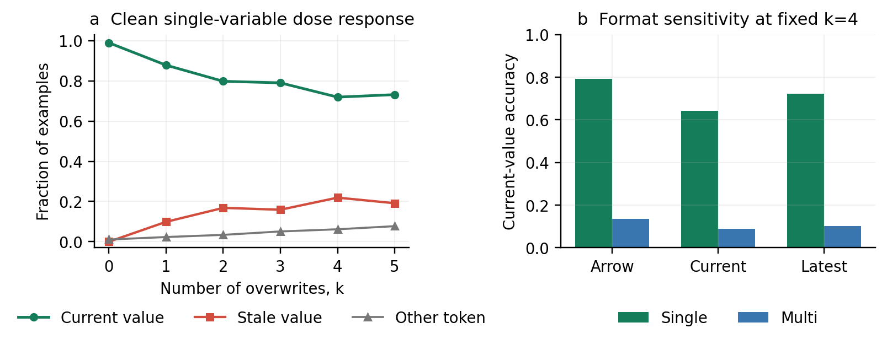
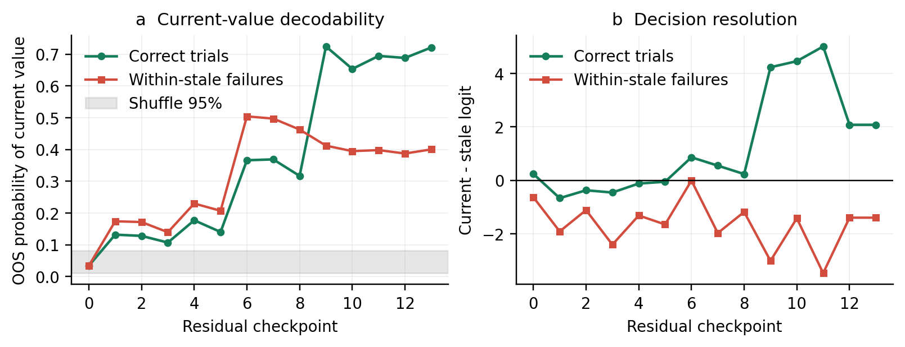
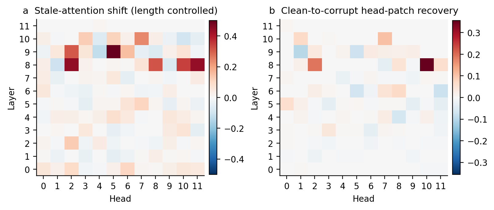
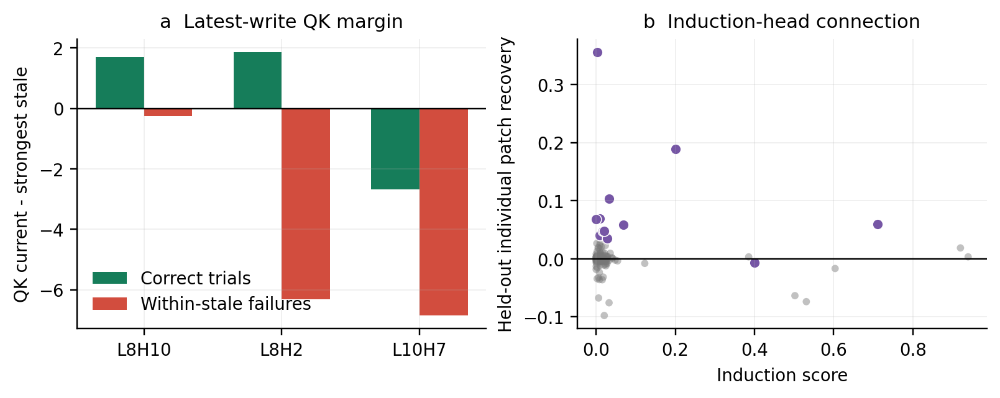
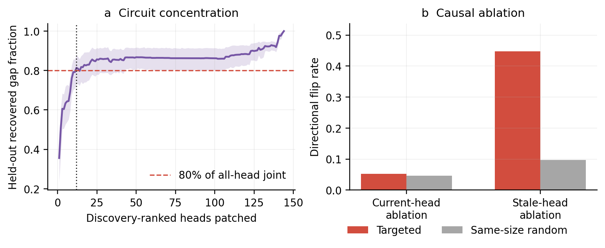

# Stage N Phase 1 Report: A Small-Pythia Stale-Binding Circuit

**Model:** `EleutherAI/pythia-160m` (12 layers, 12 heads)  
**Phase:** Phase 1 complete; Phase 2 training dynamics was not started.  
**Headline verdict:** Pythia-160m provides a valid matched stale-binding
substrate at `k=4`. A discovery-ranked set of 12/144 heads recovers 81.4% of the
held-out all-head patching effect and has an interpretable late-write QK / value-
copying OV signature. The stronger claim of a uniquely minimal, symmetrically
necessary circuit is **not supported**: ablating the recovery set raises stale
answers only about as much as same-size random sets. In contrast, a separately
predefined stale-promoting set has a large, random-control-exceeding causal
effect. The supported result is therefore a **compact sufficient recovery set
plus a specific stale-promoting subcircuit**, with residual distributed and
necessity-fragile contributions.

## 1. Protocol and task hardening

The task uses four fixed few-shot demonstrations followed by a test sequence.
All variable and value labels used in the scored bindings are single tokens for
the Pythia tokenizer. Thirty value labels recur across examples. Three surface
templates (`arrow`, `current`, and `latest`), three seeds (11, 29, 47), two
variants (single- and multi-variable), and overwrite counts `k=0,...,5` yield
7,776 examples. Each aggregated `(k, variant, template)` cell has 216 examples
(72 per seed).

The single-variable arm repeats only the target variable and supplies the clean
within-variable circuit substrate. The multi-variable arm adds genuine
distractor variables and is retained for the full taxonomy: current,
within-stale, cross-variable, and other. Every row records the current and stale
values, distractor values, write positions, exact value-token spans, and token
IDs. Generation and inference are deterministic.

For causal pairs, each observed within-stale failure is paired with an
equal-token-length clean counterfactual that replaces earlier target values
while preserving the latest value. The pairing gate validated all 96 selected
pairs. The exact identity patch changed neither the current-minus-stale gap
(maximum absolute change 0.0) nor any prediction (0/96), confirming that hooks,
positions, and pair alignment are exact.

### Documented soft-gate adaptation

The initial analysis required 150 correct and 150 within-stale single-variable
items. Full inference produced a maximum of 142 stale items at `k=4`, missing
that provisional stale threshold by eight. No task, prompt, model output, or
difficulty was changed and inference was not rerun. The selection rule was
replaced with the power-based requirement used in the final analysis: at least
150 correct, at least 120 stale (96 causal pairs plus a 20% reserve), and at
least 25 correct and 25 stale examples from every surface template. Among
passing values, maximize `min(correct, stale)` and break ties toward lower `k`.
This rule chooses `k=4`. This is a disclosed post-run soft-gate adaptation, not
an originally preregistered threshold.

## 2. Step 0: behavioral substrate

### Clean single-variable dose response

| k | n | Current correct | Accuracy (Wilson 95% CI) | Within-stale | Stale rate | Stale share of errors (Wilson 95% CI) |
|---:|---:|---:|---:|---:|---:|---:|
| 0 | 648 | 641 | 0.989 [0.978, 0.995] | 0 | 0.000 | 0.000 |
| 1 | 648 | 569 | 0.878 [0.851, 0.901] | 64 | 0.099 | 0.810 [0.710, 0.881] |
| 2 | 648 | 517 | 0.798 [0.765, 0.827] | 109 | 0.168 | 0.832 [0.759, 0.886] |
| 3 | 648 | 512 | 0.790 [0.757, 0.820] | 103 | 0.159 | 0.757 [0.679, 0.822] |
| **4** | **648** | **466** | **0.719 [0.683, 0.752]** | **142** | **0.219** | **0.780 [0.715, 0.834]** |
| 5 | 648 | 474 | 0.731 [0.696, 0.764] | 124 | 0.191 | 0.713 [0.641, 0.775] |

The no-overwrite control is essentially solved. Overwrites produce mostly
same-variable stale answers, but the dose curve is not perfectly monotone: the
small recovery from `k=4` to `k=5` must not be described as monotonic collapse.

At fixed `k=4`, format sensitivity is material but every template contributes a
usable correct and stale pool:

| Template | n | Correct | Within-stale | Other | Accuracy | Stale share of errors |
|---|---:|---:|---:|---:|---:|---:|
| Arrow | 216 | 171 | 45 | 0 | 0.792 | 1.000 |
| Current | 216 | 139 | 56 | 21 | 0.644 | 0.727 |
| Latest | 216 | 156 | 41 | 19 | 0.722 | 0.683 |

Across the three seeds at `k=4`, single-variable accuracy is 0.759, 0.708, and
0.690; the corresponding within-stale counts are 41, 49, and 52. The effect is
therefore not a single-seed artifact.

The multi-variable arm behaves differently and is not mixed into the circuit
pool: at `k=4`, 70/648 are correct, 60 are within-stale, 488 are cross-variable,
and 30 are other. Cross-variable responses comprise 84.4% of its errors. This
arm verifies the taxonomy but also shows that the clean circuit question must be
conditioned on the single-variable task.

**Gate result:** pass at `k=4`. The matched mechanism pool has 284 examples:
142 correct and 142 within-stale, balanced over nine template-by-seed strata.
The causal subset has 96 validated clean/corrupt pairs.

## 3. Retention versus selection (3a)

A standardized multinomial logistic probe decodes the 30-way current value from
the answer-position residual stream using five-fold `GroupKFold` by semantic
item. The final-layer true-current out-of-sample probability is 0.400 on
within-stale failures, far above the value-label shuffle 95% interval
[0.011, 0.081], and 0.721 on correct trials. Valid out-of-sample scores cover
280/284 examples; final-layer CV accuracy is 0.646.

The failure-minus-correct difference is -0.321 raw (bootstrap 95% CI
[-0.403, -0.239]; shuffle 95% [-0.088, 0.092]) and -0.320 after one pooled
length regression (bootstrap 95% CI [-0.396, -0.238]; shuffle 95%
[-0.087, 0.089]). Length control therefore does not explain the difference.

**Reading:** the current value remains substantially decodable when the model
answers with a stale value, supporting a selection component. Decodability is
also significantly weaker than on correct trials, so the small model exhibits
measurable retention degradation as well. This is neither pure selection nor a
retention collapse. Layers 6-8 already carry strong current-value information;
the correct/failure trajectories separate sharply at layer 9.

## 4. Direct logit attribution (3b)

The logit-lens current-minus-stale margin resolves late. At residual checkpoint
8 it averages +0.235 on correct trials and -1.182 on failures; at checkpoint 9
it separates to +4.229 versus -3.009 and remains separated through the output.
The largest individual head separation is L8H10: mean direct contribution
+0.800 on correct trials versus +0.030 on failures (difference +0.769).
Additional late contributors include L10H7 (-0.004 versus -0.255), L8H2
(+0.137 versus -0.089), L9H2 (+0.000 versus -0.192), and L8H11 (+0.019 versus
-0.156). MLP contributions also differ late, especially layer 11 (+0.688
correct versus -0.196 failure) and layer 10 (+0.177 versus -0.319).

This localizes response resolution to a late mixture of attention-head and MLP
contributions rather than a single output head.

## 5. Exhaustive attention and path patching (3c-3d)

### Attention

The average final-layer stale-attention ratio is null: length-controlled
failure-minus-correct delta +0.0009, bootstrap 95% CI [-0.0030, 0.0051], shuffle
95% [-0.0042, 0.0040]. Averaging over all heads therefore hides the mechanism.
The exhaustive 144-head table reveals localized shifts well beyond each head's
shuffle null:

| Head | Length-controlled stale-ratio delta | Bootstrap 95% CI |
|---|---:|---:|
| L9H5 | +0.501 | [0.423, 0.579] |
| L8H2 | +0.446 | [0.364, 0.533] |
| L8H11 | +0.440 | [0.369, 0.508] |
| L8H10 | +0.342 | [0.302, 0.383] |
| L8H8 | +0.317 | [0.225, 0.402] |
| L9H2 | +0.308 | [0.220, 0.393] |
| L10H7 | +0.240 | [0.163, 0.316] |

The complete table, including raw/controlled intervals and shuffle bands, is
`figures/attention_all_144_heads.csv`.

### Held-out path patching

All 144 heads were patched on 96 exact clean/corrupt pairs. Head ranking used 43
discovery pairs; all reported recovery and prefix selection used 53 held-out
evaluation pairs. Jointly patching every head defines 1.000 recovery (95% CI
[1.000, 1.000]). The strongest individual held-out heads are L8H10 (0.356,
95% CI [0.231, 0.456]), L8H2 (0.189 [0.150, 0.229]), and L10H7 (0.103
[0.070, 0.144]).

The smallest discovery-ranked prefix reaching 80% of the held-out all-head
effect contains 12 heads (8.3% of all heads): L8H10, L8H2, L10H7, L3H3, L8H8,
L6H8, L10H1, L8H11, L5H0, L9H2, L5H6, and L6H7. Joint held-out recovery is
0.814 (bootstrap 95% CI [0.726, 0.877]). The cumulative curve then plateaus near
0.86 across a broad tail and reaches 1.0 only with all heads. Thus the effect has
a compact sufficient core, but a distributed residual remains. The exhaustive
ranking is `figures/path_patch_all_144_heads.csv`.

## 6. QK/OV mechanism and induction anchor (3e-3f)

For the three strongest patched heads, the answer-position QK margin compares
the current write against the strongest stale write. OV is the source value's
direct-unembedding current-minus-stale margin before attention weighting.

| Head | QK latest margin, correct | QK latest margin, failure | Current attention, correct/failure | Stale attention, correct/failure | Current OV margin, correct/failure |
|---|---:|---:|---:|---:|---:|
| L8H10 | +1.696 | -0.259 | 0.753 / 0.398 | 0.247 / 0.602 | +0.670 / +0.637 |
| L8H2 | +1.862 | -6.311 | 0.572 / 0.082 | 0.313 / 0.600 | +0.200 / +0.185 |
| L10H7 | -2.689 | -6.853 | 0.301 / 0.069 | 0.699 / 0.931 | +0.129 / +0.100 |

For L8H10 and L8H2 in particular, failure changes *where* the head reads: the
latest-write QK margin and current-write attention collapse while stale-write
attention rises. Their OV maps remain positive and comparatively stable, so the
head can still transmit the value at whichever write it selects. This supports
a QK selection failure over latest same-variable writes, not loss of the value-
copying operation. L10H7 supplies a weaker version of the same late preference.
The full inspected-head table is `figures/qkov_key_heads.csv`.

The standard repeated-token induction diagnostic passes its preregistered
anchor: at least one selected circuit head lies in the top induction-score
decile. Four selected heads are particularly induction-like: L5H0 score 0.710
(98.6th percentile), L5H6 0.400 (95.8th), L8H2 0.201 (94.4th), and L8H11
0.068 (93.1st). The strongest causal recovery head L8H10 is not induction-like
(score 0.002, 22.9th percentile). The latest-binding circuit therefore
**partially reuses** induction-like heads; it is not identical to the model's
induction circuit.

## 7. Causal ablation (3g)

Two fixed 12-head sets were evaluated against 64 same-size random sets.

| Ablation | Baseline directional flips | Targeted | Paired 95% CI | Random-set mean | Random 95% range | Reading |
|---|---:|---:|---:|---:|---:|---|
| Recovery/current-binding set on 96 correct items: stale answers | 0.000 | 0.052 | [0.010, 0.094] | 0.047 | [0.000, 0.129] | Directional but not specific |
| Stale-promoting set on 96 stale items: correct answers | 0.000 | 0.448 | [0.344, 0.552] | 0.097 | [0.021, 0.250] | Strong and random-control-exceeding |

The recovery set is sufficient under clean-to-corrupt patching, but its 5.2%
stale increase under ablation is nearly the random-set mean and lies inside the
random range. It does not establish unique necessity. The independently fixed
stale-promoting set (ranked before ablation by stale-attention shift multiplied
by negative failure DLA) corrects 44.8% of stale trials, far above the 9.7%
random mean and above the full random 95% range. This is the strongest causal
validation in Phase 1.

## 8. Pre-registered adjudication

| Reading / gate | Outcome | Evidence-based interpretation |
|---|---|---|
| Fixed-size behavioral substrate | **Pass** | `k=4`: 466 correct and 142 stale single-variable items; matched 142/142 pool |
| Retention versus selection | **Selection with retention nuance** | Failure decodability 0.400 > shuffle upper 0.081, but below correct 0.721 after length control |
| Exhaustive head localization | **Pass, localized not global** | All-head average attention is null; multiple layer-8/9 heads exceed per-head shuffle nulls |
| Compact causal sufficiency | **Pass** | 12/144 heads recover 0.814 [0.726, 0.877] of held-out all-head patching effect |
| QK/OV interpretation | **Pass for key late heads** | Failure primarily collapses latest-write QK selection while OV value copying persists |
| Induction connection | **Partial pass** | Several selected heads are top-decile induction heads; strongest recovery head is not |
| Current-binding necessity | **Not specific** | Targeted ablation 0.052 versus random mean 0.047 |
| Stale-promoting causal set | **Pass** | Targeted correction 0.448 versus random mean 0.097; exceeds random 95% range |
| Strong “minimal clean circuit” claim | **Withheld / qualified** | Compact sufficiency and interpretable QK/OV pass, but symmetric unique necessity does not |

The kill-gate is therefore honored without forcing a cleaner story. The effect
is not broadly distributed in the sufficiency sense: 8.3% of heads recover more
than 80% of the all-head effect. It is also not a fully isolated minimal circuit:
the tail contributes residual recovery, and the current-binding set is not
specifically necessary relative to random ablations.

## 9. Deliverables and run record

- `src/pythia_gen.py`: hardened single-/multi-variable generation and metadata.
- `src/pythia_eval.py`: deterministic inference, taxonomy, fixed-k selection,
  matching, and exact counterfactual pair construction.
- `src/pythia_circuit.py`: harvesting, grouped probes, length controls, shuffle
  nulls, DLA/logit lens, exhaustive attention and patching, QK/OV, induction,
  and random-controlled ablation.
- `src/pythia_figs.py`: Phase-1 figures and exhaustive CSV tables.
- `behavior_full_cpu/`: 7,776 raw behavioral rows, summaries, 284-item matched
  pool, and 96 exact causal pairs.
- `mechanism_full_cpu/`: 284-item activation harvest, all probe rows, and 3a-3c
  summaries.
- `mechanism_full_core_ai32/`: exhaustive 3d-3f rows and summaries.
- `ablation_full_ai32/`: 3g targeted and random-control summary.
- `figures/`: five PNG/PDF figures and three numeric CSV tables.

The corrected behavior smoke, pair generation, mechanism smoke, seven grouped-
probe chunks, aggregate analysis, GPU patching/QK/OV/induction run, and GPU
ablation run completed. The original combined harvest-and-analysis job wrote all
284/284 activations, then was cancelled while fitting its first probe because
serial probe fitting was too slow; the exact completed harvest was reused by the
seven successful CPU probe chunks. An earlier full behavior analysis exited at
the obsolete 150-stale soft threshold after safely writing the raw rows; the
final `rescore` step produced the canonical summary without rerunning inference.
No Stage J/K/L, Paper-1, or `paper/` artifacts were changed.

## 10. Stop condition

Stage N Phase 1 is complete and awaits review. **Phase 2 checkpoint/training-
dynamics work has not been launched.**
