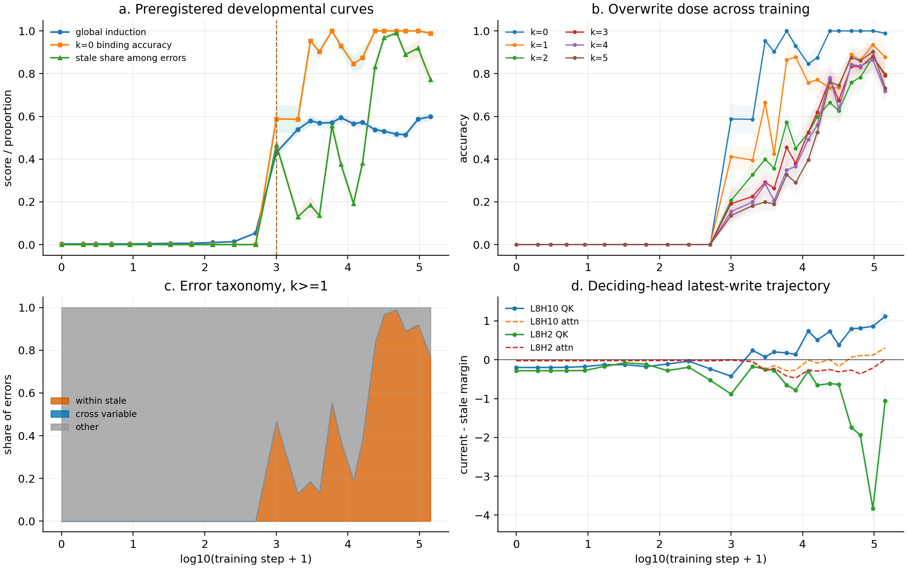

# Stage N Phase 2 Report: Training Dynamics of Stale Binding

## Pre-registered question and answer

Does stale-binding emerge at the induction-head phase transition?

**SUPPORTED on this preregistered Pythia-160m trajectory.** The stale-error transition coincides with or immediately follows the induction transition, and the error taxonomy shifts from non-stale errors toward within-variable stale values.

This is a one-model, single-variable developmental result. It does not establish a
cross-model training law.

## Transition estimates

The point estimator is the right endpoint of the largest positive adjacent-checkpoint
level change. Intervals use 2,000 hierarchical seed-then-item/sequence bootstrap
replicates. A transition is called abrupt/reliable only when at least 95% of bootstrap
replicates detect a positive jump and at least 50% place it within one grid index of the
point estimate.

| transition | step | bootstrap 95% interval | jump | local bootstrap mass | reliable |
|---|---:|---:|---:|---:|:---:|
| `S_ind` | 1,000 | [1,000, 1,000] | 0.3762 | 1.000 | true |
| `S_bind` | 1,000 | [1,000, 1,000] | 0.5880 | 1.000 | true |
| `S_stale` | 1,000 | [1,000, 24,000] | 0.4674 | 0.666 | true |

`S_ind` is the global in-distribution induction score, `S_bind` is k=0 accuracy,
and `S_stale` is the within-stale share among all k>=1 errors after applying the
failure-pool gate. “Immediately follows” was fixed as the next checkpoint in the
ordered preregistered grid.

## Alignment and ordering

- Temporal gate: **TRUE**.
- Taxonomy gate: **TRUE**.
- Core gate: **TRUE**.
- Basic binding and stale-binding onset share the same point estimate.
- Across step 512 to 1,000, the within-stale error share changes by +0.467 and the `other` share by -0.467.

## Behavioral and mechanism checks

- All 25/25 checkpoint-level stale-onset pools pass the preregistered minimum
  of 30 total k>=1 errors and at least 5 errors per seed.
- The behavior substrate is unchanged from Phase 1: single-variable arm, templates
  `arrow/current/latest`, seeds 11/29/47, digit values, and k=0..5, with 3,888 rows
  per checkpoint.
- The induction probe repeats contiguous 24-token windows sampled from those frozen
  prompts; it does not use the invalid uniform-token pilot.
- QK/attention trajectories use all 648 frozen k=4 prompts and only the preregistered
  deciding heads L8H10 and L8H2.
- L8H10: final mean QK latest margin 1.119; attention latest margin 0.304.
- L8H2: final mean QK latest margin -1.055; attention latest margin 0.005.

## Artifacts and scope

Exact initial checkpoint set: 0, 1, 2, 4, 8, 16, 32, 64, 128, 256, 512, 1000, 2000, 3000, 4000, 6000, 8000, 12000, 16000, 24000, 32000, 48000, 64000, 96000, 143000.
Each step corresponds to 2,097,152 training tokens. No post-result task tuning was
performed. The initial grid was not automatically densified; any densification around
an uncertain transition is a review-gated follow-up and must preserve the same task and
estimators.
