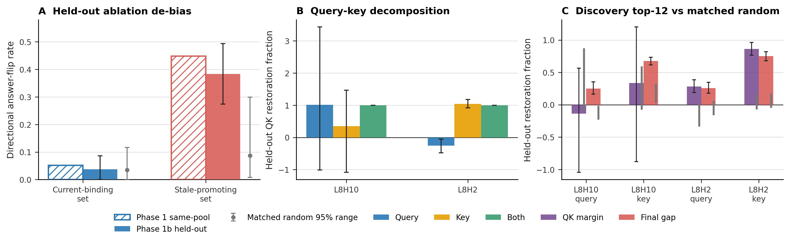

# Stage N Phase 1b Addendum: Held-out Ablation and Upstream QK Attribution

**Model:** `EleutherAI/pythia-160m`  
**Fixed substrate:** Phase-1 single-variable `k=4` task and the same 96 validated
clean/corrupt pairs.  
**Scope:** Phase-1 canonical results were not modified. Phase 2 was not started.

## Headline verdict

Task A's strongest causal result survives the required de-bias, but shrinks:
the discovery-ranked stale-promoting ablation corrects **0.384** of held-out
stale responses (95% CI [0.274, 0.493]), above the matched-random 95% range
[0.008, 0.299]. The Phase-1 same-pool estimate was 0.448, so selection and
evaluation on the same pool inflated the estimate by **0.064** (6.4 percentage
points). The current-binding ablation remains non-specific.

Task B supports a **key-side upstream source for L8H2**, not one universal source
for both deciding heads. Direct Q/K replacement attributes L8H2's flip to its
write-position keys. A discovery-ranked upstream set on that key path restores
held-out QK margin by 0.861 and the final gap by 0.752, far above matched random
controls; six components already cross the preregistered 80% discovery gate.
For L8H10, the normalized query-vs-key attribution is unresolved and no upstream
path clears both compactness and matched-control gates. Thus Phase 1b finds one
specific upstream key pathway and leaves the other deciding head diffuse or
unresolved.

The positional/recency gate fails for all four target-side paths. No claim that
the upstream signal is positional or recency-coded is supported.

## 1. Protocol and hard gates

- `stable_split(semantic_id)` yields 43 discovery and 53 held-out evaluation
  pairs for B. Discovery alone ranks components; every headline is evaluated on
  the 53 held-out pairs.
- B2 scans every earlier component for each query/key path: 96 attention heads
  plus eight MLPs from layers 0-7, or 104 components and 208 side-specific
  paths per deciding head's readout.
- Components are ranked on discovery by the minimum of mean QK recovery and
  mean final-gap recovery. The fixed headline set is the discovery top 12. The
  first prefix reaching 80% of positive all-upstream discovery restoration is
  descriptive; the gate requires crossing by 12 and exceeding 64 matched
  random 12-component sets on both held-out QK and final-gap recovery.
- Random components match type and layer where possible. Every random set is
  evaluated on the same held-out rows as the selected set.
- Intervals use 2,000 paired bootstrap resamples. B3 uses a 2,000-resample
  Spearman bootstrap and a preregistered conjunction with attention structure.
- Exact corrupt-to-corrupt identity checks cover every B1 side, all 208 scanned
  single-component side paths, both all-upstream paths, and the four selected
  top-12 validation paths: maximum absolute QK, attention-preference, and
  final-gap change are all 0.0; prediction changes are 0. The random sets reuse
  the same checked hook implementation. The 96 validation rows are six disjoint
  16-row shards whose IDs are unique and whose random definitions were verified
  identical before merge.

## 2. Task A: held-out ablation de-bias

The ablation split contains 61/81 discovery/evaluation correct items and 69/73
discovery/evaluation within-stale items. Both targeted sets are selected without
using their evaluation rows, and all random controls use the same held-out rows.

| Ablation arm | Phase-1 same-pool | Phase-1b held-out (95% CI) | Random mean | Random 95% range | Gate |
|---|---:|---:|---:|---:|---|
| Current-binding set: stale flips | 0.052 | 0.037 [0.000, 0.086] | 0.035 | [0.000, 0.116] | Fail: non-specific |
| Stale-promoting set: correct flips | 0.448 | 0.384 [0.274, 0.493] | 0.087 | [0.008, 0.299] | **Pass** |

The stale-promoting claim therefore survives discovery/held-out separation, but
the supported effect is 0.384 rather than 0.448. The 0.064 gap is the quantified
same-pool optimism. The held-out pool has 73 stale items, sufficient for the
single preregistered stable split; no repeated-split replacement was needed.

## 3. B1: query side versus key side

Clean-to-corrupt replacement separately patches the deciding head's answer-
position query and all target-write keys. QK restoration is normalized per pair
against the clean/corrupt difference; raw QK change is reported beside it because
small per-item denominators make L8H10's normalized intervals broad. The formal
side reading follows the preregistered normalized query-minus-key interval.

| Head | Query QK recovery | Key QK recovery | Query minus key (95% CI) | Key final-gap recovery | Formal reading |
|---|---:|---:|---:|---:|---|
| L8H10 | 1.010 [-1.013, 3.429] | 0.353 [-1.085, 1.465] | 0.657 [-2.400, 4.535] | 0.400 [0.291, 0.477] | Mixed / unresolved |
| L8H2 | -0.257 [-0.480, -0.056] | 1.042 [0.917, 1.181] | -1.299 [-1.616, -1.003] | 0.232 [0.178, 0.309] | **Key side** |

Patching both Q and K restores QK by exactly 1.0 for both heads, confirming that
the decomposition closes at the target head. L8H2's query patch is harmful while
its key patch restores QK, attention, and the final gap; this is a clear key-side
interference result.

L8H10 has a key-like raw companion pattern: query replacement changes QK by
-0.712 [-1.001, -0.448], while key replacement changes it by +2.129
[1.783, 2.461]. However, its preregistered normalized query-minus-key interval
crosses zero, so this pattern is not promoted to the formal side attribution.

## 4. B2: upstream components feeding the deciding heads

| Target path | First 80% crossing | Top-12 held-out QK | Random QK 95% upper | Top-12 held-out final gap | Random final 95% upper | Root gate |
|---|---:|---:|---:|---:|---:|---|
| L8H10 query | None | -0.139 [-1.045, 0.564] | 0.872 | 0.250 [0.163, 0.352] | -0.015 | Fail |
| L8H10 key | 11 | 0.337 [-0.878, 1.201] | 0.595 | 0.675 [0.614, 0.734] | 0.323 | Fail: QK not specific |
| L8H2 query | None | 0.283 [0.189, 0.385] | 0.021 | 0.258 [0.178, 0.347] | 0.059 | Fail: no compact crossing |
| **L8H2 key** | **6** | **0.861 [0.767, 0.962]** | **0.158** | **0.752 [0.680, 0.818]** | **0.172** | **Pass** |

The L8H2-key discovery top 12 are L7H7, L6H2, L7H4, L5H11, L4H11,
L5H10, L3H0, L6H6, L5H8, L3MLP, L3H4, and L4H1. Jointly they recover
0.861 of held-out QK and 0.752 of the held-out final-gap lesion, versus random
means 0.035 and 0.064. This is the supported upstream causal pathway.

The apparent L8H2-query selected effect is not a pass: all-upstream discovery
QK restoration is negative, so no positive all-upstream source exists for a
top-12 prefix to recover by 80%. L8H10-key restores the final gap but its QK
restoration lies inside the matched-random range. The kill-gate therefore
forbids a two-head minimal circuit claim. L8H10's latest-write input remains
diffuse or unidentifiable under this component basis.

## 5. B3: positional/recency test

The tested distance is the token gap between the current write and the stale
competitor that wins in the corrupted member of each pair. It takes values
4/8/12 on 64/24/8 pairs. Positionality requires both a nonzero held-out
effect-distance correlation and at least half of selected attention-head feeders
to be top-decile previous-token or latest-write-structured heads.

| Target path | Spearman rho (bootstrap 95%) | Structured selected heads | Gate |
|---|---:|---:|---|
| L8H10 query | -0.207 [-0.483, 0.096] | 1/11 (0.091) | Fail |
| L8H10 key | -0.365 [-0.574, -0.126] | 4/9 (0.444) | Fail |
| L8H2 query | -0.075 [-0.354, 0.211] | 1/12 (0.083) | Fail |
| L8H2 key | -0.042 [-0.314, 0.232] | 4/11 (0.364) | Fail |

L8H10-key has a nonzero negative correlation in isolation, but misses the
pre-registered attention-structure threshold. The other three correlations
cross zero. The conjunction fails everywhere, so Phase 1b does **not** label the
identified L8H2-key pathway as a positional or recency circuit.

## 6. B4 and preregistered adjudication

B4 was not run. Existing Phase-1 activations contain only `k=4`; a `k=1..5`
curve would require a new activation sweep and is not cheap reuse.

| Reading | Outcome | Interpretation |
|---|---|---|
| Held-out stale-promoting ablation | **Pass** | 0.384 exceeds random upper 0.299; same-pool estimate was optimistic by 0.064 |
| Held-out current-binding ablation | Fail / unchanged | 0.037 lies inside random range; necessity remains non-specific |
| B1 L8H2 side attribution | **Pass: key** | Key QK recovery 1.042; query recovery -0.257; difference CI excludes zero |
| B1 L8H10 side attribution | Unresolved | Normalized query-minus-key CI crosses zero despite a key-like raw change |
| B2 L8H2-key upstream root | **Pass** | Top 12 exceed random on QK and final gap; crossing at six components |
| Other B2 paths | Fail / diffuse | Each misses compactness, matched QK specificity, or both |
| B3 positionality | **Fail for all paths** | No path passes both correlation and structured-feeder conditions |
| Identity patch | **Pass** | Exact zero for all scanned component paths and selected top-12 validation paths |

## 7. Artifacts and run record

- `a_full_cpu/ablation_heldout.summary.json` and
  `a_full_cpu/ablation_random_sets.jsonl`: Task A headline and 128 random-set
  records. CPU job 19750435 completed in 15:16.
- `b_scan_full_ai/`: 96-row B1/B2 exhaustive scan. H100 job 19751043 completed
  in 4:44.
- `upstream_ranking.json`: discovery-only component rankings for four
  target-side paths.
- `b_validate_shards_ai/`: six disjoint 16-row validation shards. Array
  19752897 completed every task in 4:09-5:15 with exact identity.
- `b_validate_full_merged/`: verified 96-row held-out validation and 64 matched
  random sets per target-side path.
- `upstream.summary.json`: B1-B4 bootstrap analyses and all gate decisions.
- `figures/N6_phase1b.{png,pdf}`: summary figure rendered from saved summaries.

A lean-attention optimization was tested and rejected because its manually
reconstructed attention differed from the model output by about 7.6e-6 on the
identity smoke. No lean output enters any headline. Final results use the exact
model attention path and satisfy the zero-effect identity gate.

**Final scope:** this is a causal account for one small model on the fixed
single-variable substrate. It does not establish a cross-scale circuit, a
universal key-side mechanism, or a positional/recency code. Phase 2 remains not
started.
