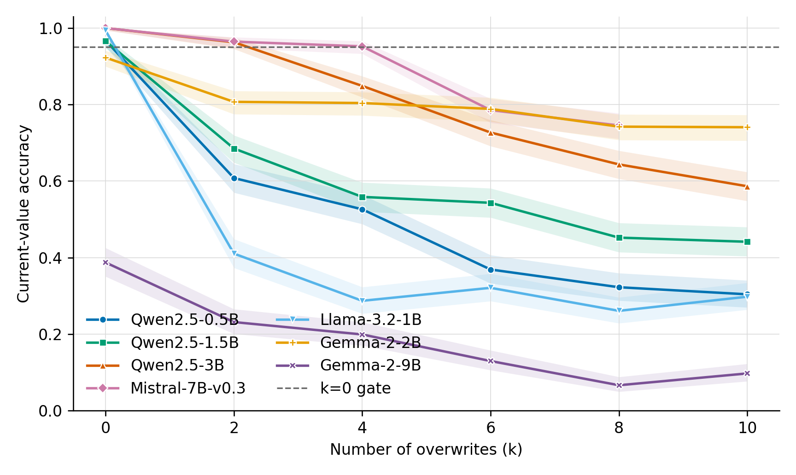

# Stage O Part D: cross-family behavioral sweep

Behavioral universality matrix only; no probe, circuit, or prevalence claim.

| Family/size | k=0 acc | acc at cap | errors at cap | stale share (95% CI) | cross | other | template range |
|---|---:|---:|---:|---:|---:|---:|---:|
| Qwen2.5-0.5B | 0.968 | 0.304 | 451 | 0.987 [0.971, 0.994] | 0 | 6 | 0.134 |
| Qwen2.5-1.5B | 0.966 | 0.441 | 362 | 1.000 [0.989, 1.000] | 0 | 0 | 0.255 |
| Qwen2.5-3B | 1.000 | 0.586 | 268 | 1.000 [0.986, 1.000] | 0 | 0 | 0.120 |
| Mistral-7B-v0.3 | 1.000 | 0.745 | 165 | 1.000 [0.977, 1.000] | 0 | 0 | 0.139 |
| Llama-3.2-1B | 0.994 | 0.298 | 455 | 1.000 [0.992, 1.000] | 0 | 0 | 0.106 |
| Gemma-2-2B | 0.923 | 0.741 | 168 | 0.958 [0.917, 0.980] | 0 | 7 | 0.153 |
| Gemma-2-9B | 0.387 | 0.097 | 585 | 0.051 [0.036, 0.072] | 0 | 555 | 0.264 |

## Qwen2.5-0.5B

| k | n | accuracy | correct | stale | cross | other |
|---:|---:|---:|---:|---:|---:|---:|
| 0 | 648 | 0.968 | 627 | 0 | 0 | 21 |
| 2 | 648 | 0.608 | 394 | 252 | 0 | 2 |
| 4 | 648 | 0.526 | 341 | 307 | 0 | 0 |
| 6 | 648 | 0.369 | 239 | 407 | 0 | 2 |
| 8 | 648 | 0.323 | 209 | 439 | 0 | 0 |
| 10 | 648 | 0.304 | 197 | 445 | 0 | 6 |

Tokenizer cap: n_lines=15, k_cap=10. Multi-variable taxonomy counts: {'correct_current': 89, 'cross_variable': 270, 'other': 20, 'within_stale': 269}.

## Qwen2.5-1.5B

| k | n | accuracy | correct | stale | cross | other |
|---:|---:|---:|---:|---:|---:|---:|
| 0 | 648 | 0.966 | 626 | 0 | 0 | 22 |
| 2 | 648 | 0.685 | 444 | 204 | 0 | 0 |
| 4 | 648 | 0.559 | 362 | 286 | 0 | 0 |
| 6 | 648 | 0.543 | 352 | 296 | 0 | 0 |
| 8 | 648 | 0.452 | 293 | 355 | 0 | 0 |
| 10 | 648 | 0.441 | 286 | 362 | 0 | 0 |

Tokenizer cap: n_lines=15, k_cap=10. Multi-variable taxonomy counts: {'correct_current': 200, 'cross_variable': 43, 'within_stale': 405}.

## Qwen2.5-3B

| k | n | accuracy | correct | stale | cross | other |
|---:|---:|---:|---:|---:|---:|---:|
| 0 | 648 | 1.000 | 648 | 0 | 0 | 0 |
| 2 | 648 | 0.963 | 624 | 24 | 0 | 0 |
| 4 | 648 | 0.849 | 550 | 98 | 0 | 0 |
| 6 | 648 | 0.727 | 471 | 177 | 0 | 0 |
| 8 | 648 | 0.644 | 417 | 231 | 0 | 0 |
| 10 | 648 | 0.586 | 380 | 268 | 0 | 0 |

Tokenizer cap: n_lines=15, k_cap=10. Multi-variable taxonomy counts: {'correct_current': 314, 'cross_variable': 27, 'within_stale': 307}.

## Mistral-7B-v0.3

| k | n | accuracy | correct | stale | cross | other |
|---:|---:|---:|---:|---:|---:|---:|
| 0 | 648 | 1.000 | 648 | 0 | 0 | 0 |
| 2 | 648 | 0.965 | 625 | 23 | 0 | 0 |
| 4 | 648 | 0.952 | 617 | 31 | 0 | 0 |
| 6 | 648 | 0.785 | 509 | 139 | 0 | 0 |
| 8 | 648 | 0.745 | 483 | 165 | 0 | 0 |

Tokenizer cap: n_lines=12, k_cap=8. Multi-variable taxonomy counts: {'correct_current': 351, 'cross_variable': 6, 'within_stale': 291}.

## Llama-3.2-1B

| k | n | accuracy | correct | stale | cross | other |
|---:|---:|---:|---:|---:|---:|---:|
| 0 | 648 | 0.994 | 644 | 0 | 0 | 4 |
| 2 | 648 | 0.410 | 266 | 382 | 0 | 0 |
| 4 | 648 | 0.287 | 186 | 462 | 0 | 0 |
| 6 | 648 | 0.321 | 208 | 440 | 0 | 0 |
| 8 | 648 | 0.261 | 169 | 479 | 0 | 0 |
| 10 | 648 | 0.298 | 193 | 455 | 0 | 0 |

Tokenizer cap: n_lines=15, k_cap=10. Multi-variable taxonomy counts: {'correct_current': 140, 'cross_variable': 77, 'within_stale': 431}.

## Gemma-2-2B

| k | n | accuracy | correct | stale | cross | other |
|---:|---:|---:|---:|---:|---:|---:|
| 0 | 648 | 0.923 | 598 | 0 | 0 | 50 |
| 2 | 648 | 0.807 | 523 | 113 | 0 | 12 |
| 4 | 648 | 0.804 | 521 | 122 | 0 | 5 |
| 6 | 648 | 0.789 | 511 | 128 | 0 | 9 |
| 8 | 648 | 0.742 | 481 | 162 | 0 | 5 |
| 10 | 648 | 0.741 | 480 | 161 | 0 | 7 |

Tokenizer cap: n_lines=15, k_cap=10. Multi-variable taxonomy counts: {'correct_current': 164, 'cross_variable': 98, 'other': 4, 'within_stale': 382}.

## Gemma-2-9B

| k | n | accuracy | correct | stale | cross | other |
|---:|---:|---:|---:|---:|---:|---:|
| 0 | 648 | 0.387 | 251 | 0 | 0 | 397 |
| 2 | 648 | 0.231 | 150 | 74 | 0 | 424 |
| 4 | 648 | 0.199 | 129 | 19 | 0 | 500 |
| 6 | 648 | 0.130 | 84 | 8 | 0 | 556 |
| 8 | 648 | 0.066 | 43 | 12 | 0 | 593 |
| 10 | 648 | 0.097 | 63 | 30 | 0 | 555 |

Tokenizer cap: n_lines=15, k_cap=10. Multi-variable taxonomy counts: {'correct_current': 17, 'cross_variable': 8, 'other': 447, 'within_stale': 176}.

